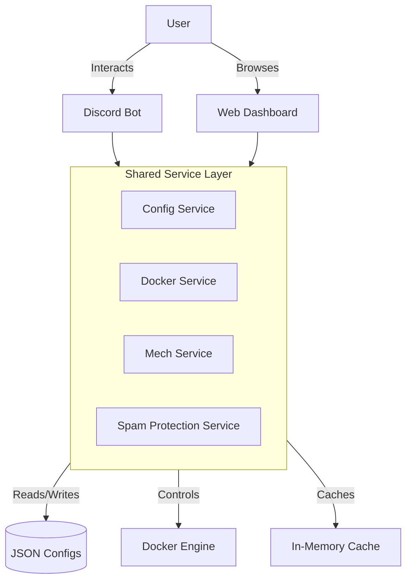

# System Architecture

DockerDiscordControl follows a clean, service-oriented architecture designed for reliability, performance, and ease of maintenance.

## High-Level Overview

The application consists of two main frontends sharing a common backend service layer:

1.  **Discord Bot**: Built with `py-cord`, providing the chat interface and interaction handling.
2.  **Web UI**: Built with `Flask`, providing the dashboard and configuration interface.

Both frontends communicate with the underlying system through a set of specialized **Services**.

## Core Design Principles

### 1. Single Source of Truth
All configuration and state data is managed centrally. 
*   **Configuration**: The `ConfigService` is the sole authority for settings, aggregating data from JSON files and environment variables.
*   **Mech State**: The `MechDataStore` is the single point of truth for the Mech's level, power, and evolution status.

### 2. Service-First Pattern
Logic is never duplicated between the Bot and the Web UI. Both call the same methods in the service layer (e.g., `get_docker_containers_live()`). This ensures consistent behavior regardless of where the action is initiated.

### 3. Caching Strategy
To ensure responsiveness and minimize resource usage, DDC employs aggressive caching:
*   **Docker Cache**: Container lists are cached for short durations (default 30s) to prevent overwhelming the Docker daemon.
*   **Mech Animations**: 
    *   **Static**: Unlocked displays and shadows are pre-rendered to disk (`cached_displays/`).
    *   **Dynamic**: Walking animations are cached in RAM with strict limits using `cachetools` to balance performance and memory usage.
*   **Config Cache**: Configuration files are cached in memory to avoid constant disk I/O.

## Directory Structure

*   `app/`: Main application code (Web UI blueprints, templates).
*   `cogs/`: Discord bot extensions (commands, listeners).
*   `services/`: The core business logic layer.
    *   `config/`: Configuration management.
    *   `mech/`: Mech evolution and animation logic.
    *   `infrastructure/`: System-level services (events, spam protection).
    *   `web/`: Web-specific data preparation.
*   `config/`: JSON configuration files (persistent storage).
*   `cached_animations/`: Storage for generated WebP animations.

## Data Flow: The Mech System

1.  **Event Trigger**: A donation event occurs (simulated or real).
2.  **State Update**: `MechService` updates the `total_donated` value in `mech_config.json`.
3.  **Calculation**: `MechDataStore` recalculates the Power level (applying daily decay) and Evolution level.
4.  **Notification**: An event is fired via `EventManager`.
5.  **Reaction**: 
    *   `AnimationCacheService` invalidates its cache.
    *   The Bot posts an update to the configured channel.
    *   The Web UI reflects the new status immediately via the shared data store.
